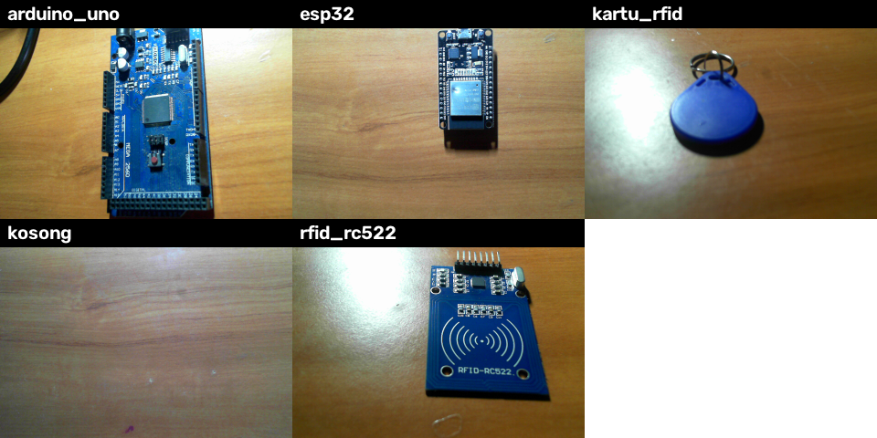

# Dokumen Desain Awal: Pemilah Komponen Mikrokontroler Berbasis Webcam

**Mata kuliah:** RET503 (Pertemuan 3, Transfer Learning) · CDIO Stage 2 Design

## 1. Misi projek

Sistem pemilah komponen mikrokontroler berbasis webcam. Bagian persepsi bertugas mengenali jenis komponen yang diletakkan di bawah kamera (Arduino Uno, ESP32, kartu RFID, modul RC522) dan menolak benda lain dengan jawaban **BUKAN**, sebagai dasar keputusan pemilahan.

## 2. Kelas objek

| Kelas         | Keterangan                                            |
| ------------- | ----------------------------------------------------- |
| `arduino_uno` | Papan Arduino Uno                                     |
| `esp32`       | Papan pengembangan ESP32                              |
| `kartu_rfid`  | Kartu RFID (tanpa modul di dalam frame)               |
| `rfid_rc522`  | Modul pembaca RFID RC522 (tanpa kartu di dalam frame) |
| `kosong`      | Meja kosong tanpa barang                              |

Benda lain di luar kelas di atas dijawab **BUKAN** lewat penolakan berbasis kemiripan fitur. Komponen diambil dari stok yang tersedia di laci/loker.

## 3. Kamera dan dudukan

| Item          | Nilai                                         |
| ------------- | --------------------------------------------- |
| Kamera        | Webcam USB Microsoft (HD)                     |
| Resolusi      | 640 × 480 piksel                              |
| Tinggi kamera | 20 cm dari meja                               |
| Sudut         | Menghadap ke meja                             |
| Jarak kerja   | ± 20 cm (komponen diletakkan di bawah kamera) |
| Latar         | Permukaan meja polos                          |

## 4. Unit komputasi

Laptop Dell Vostro 3400: Intel Core i3-1115G4 @ 3,0 GHz (2 core / 4 thread), RAM 12 GB, SSD NVMe 256 GB, Intel UHD Graphics (tanpa GPU diskrit), Windows 10 Pro. Inferensi dijalankan di **CPU** (PyTorch versi CPU), mode daya bawaan Windows.

## 5. Target kinerja

| Metrik                | Target                                                 |
| --------------------- | ------------------------------------------------------ |
| Akurasi validasi      | ≥ 95% pada sesi cahaya yang tidak dipakai latihan      |
| Penolakan benda asing | ≥ 90% benda non-komponen dijawab BUKAN pada uji manual |
| Kecepatan             | ≥ 10 FPS (≤ 100 ms per frame, seluruh pipeline) di CPU |

Target kecepatan diverifikasi dengan `latency.py`. Anggaran awal per frame: akuisisi kamera ± 30 ms, preprocessing ± 10 ms, inferensi ± 50 ms, penampilan hasil ± 10 ms (akan diukur dan diperbarui).

## 6. Kandidat model

| Model                          | Parameter  | GFLOPs | Top-1 ImageNet | Alasan                                                |
| ------------------------------ | ---------- | ------ | -------------- | ----------------------------------------------------- |
| **MobileNetV3-Large** (utama)  | ≈ 5,5 juta | ≈ 0,22 | ≈ 74,0%        | Ringan, akurasi dasar baik, cocok untuk CPU tanpa GPU |
| MobileNetV3-Small (pembanding) | ≈ 2,5 juta | ≈ 0,06 | ≈ 67,7%        | Lebih cepat, dipakai jika target FPS tidak tercapai   |

ResNet-18 juga diukur latensinya sebagai pembanding tambahan.

## 7. Strategi transfer learning

Dimulai dari **feature extraction** (backbone beku, hanya classifier baru yang dilatih) karena data hanya ratusan citra. Dibandingkan dengan fine-tuning parsial (blok akhir dibuka, learning rate lebih kecil) dan scratch (tanpa pretrained). Preprocessing identik saat latihan dan pemakaian (RGB, 224 × 224, mean/std ImageNet).

_Hasil awal (10 epoch):_ feature 100% val, partial 99,31%, scratch 24,05%.

## 8. Rencana data

- Target: ≥ 50 citra per kelas. Terkumpul saat ini: arduino_uno 99, esp32 135, kartu_rfid 170, rfid_rc522 150, kosong 50.
- Variasi: cahaya terang dan redup; posisi, orientasi (depan, belakang, miring), dan latar divariasikan.
- Struktur: `dataset_raw/<kelas>/<kelas>_<tanggal>_lab_<cahaya>_<nomor>.png` dan `metadata.csv` (nama_file, kelas, tanggal, kondisi_cahaya).
- Pembagian train/val **per sesi** (tanggal + kondisi cahaya) agar tidak terjadi kebocoran data.

## 9. Risiko dan mitigasi

| Risiko                                                               | Mitigasi                                                                                               |
| -------------------------------------------------------------------- | ------------------------------------------------------------------------------------------------------ |
| Benda asing dikira komponen (laptop sempat dikira Arduino)           | Kelas `kosong` dan penolakan BUKAN berbasis kemiripan fitur (`build_gallery.py`), ambang dapat disetel |
| Perbedaan cahaya antara latihan dan pemakaian                        | Data terang dan redup, split per sesi, tambah kondisi lain (jendela, bayangan)                         |
| Overfitting karena data kecil                                        | Transfer learning (feature extraction), bukan scratch (terbukti: scratch hanya 24% val)                |
| Jumlah foto tidak seimbang antar kelas (kosong 50 vs kartu_rfid 170) | Tambah foto kelas yang sedikit, pantau akurasi per kelas                                               |
