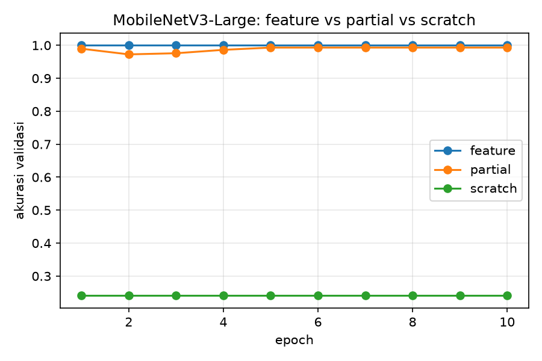
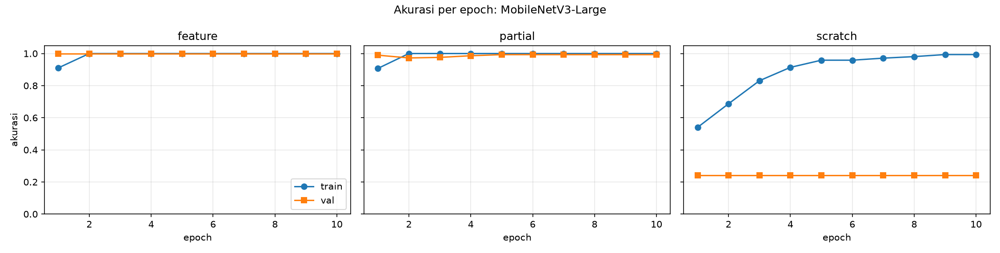

# Klasifikasi Komponen Mikrokontroler dengan MobileNetV3-Large

Tugas RET503, Pertemuan 3 (Transfer Learning).
**Kelompok:** Yasin, Raja, Cahyo, Walter

## 1. Ringkasan
Proyek ini membangun sistem pengenalan komponen mikrokontroler menggunakan webcam. Model MobileNetV3-Large (bobot awal ImageNet) dilatih untuk mengenali lima kelas, yaitu `arduino_uno`, `esp32`, `kartu_rfid`, `rfid_rc522`, dan `kosong` (meja tanpa barang). Benda di luar kelas tersebut dijawab **BUKAN**. Tiga pendekatan transfer learning dibandingkan: *feature extraction*, *fine-tuning parsial*, dan *scratch*.

Rancangan awal sistem ada pada [DESAIN_AWAL.md](DESAIN_AWAL.md).

## 2. Data
- Diambil sendiri menggunakan webcam Microsoft (HD) dengan tinggi kamera 20 cm. Seluruh citra berukuran 640 × 480 piksel.
- Dua kondisi cahaya: terang dan redup.
- Kalibrasi kamera tidak diterapkan pada dataset ini.
- Total 604 citra (ukuran folder sekitar 583 MB).

| Kelas | Terang | Redup | Total |
|---|---|---|---|
| arduino_uno | 49 | 50 | 99 |
| esp32 | 65 | 70 | 135 |
| kartu_rfid | 88 | 82 | 170 |
| rfid_rc522 | 70 | 80 | 150 |
| kosong | 25 | 25 | 50 |

- Struktur: `dataset_raw/<kelas>/<kelas>_<tanggal>_lab_<cahaya>_<nomor>.png` dan `dataset_raw/metadata.csv` (kolom `nama_file, kelas, tanggal, kondisi_cahaya`).
- Pembagian data latih dan validasi dilakukan **per sesi** (tanggal dan kondisi cahaya), bukan acak per foto. Data validasi berjumlah 291 citra dari sesi cahaya yang tidak dipakai untuk latihan.

## 3. Hasil perbandingan tiga mode
Setiap mode dilatih 10 epoch pada CPU. Akurasi validasi adalah ketepatan model pada citra yang tidak dipakai untuk belajar.

| Mode | Pendekatan | Akurasi val terbaik | Akurasi train akhir | Waktu latih (dtk) | Epoch pertama val ≥ 90% |
|---|---|---|---|---|---|
| feature | Feature extraction (backbone beku) | 100.00% | 100.00% | 188 | 1 |
| partial | Fine-tuning parsial (blok akhir) | 99.31% | 100.00% | 219 | 1 |
| scratch | Scratch (tanpa pretrained) | 24.05% | 99.36% | 377 | tidak tercapai |




**Temuan:**
- Mode *feature extraction* mencapai 100% (291 dari 291 citra benar) dengan waktu latih tercepat.
- Mode *fine-tuning parsial* mencapai 99,31% (2 citra salah) dengan waktu latih lebih lama.
- Mode *scratch* memiliki akurasi latih 99,36% tetapi akurasi validasi hanya 24,05%. Angka ini sama dengan proporsi kelas `rfid_rc522` pada data validasi (70 dari 291 citra). Penyebab pastinya tidak diuji dalam praktikum ini.

## 4. Latensi model terpilih
Model terpilih: **MobileNetV3-Large, mode feature extraction**. Pengukuran dilakukan pada CPU Intel Core i3-1115G4 (Dell Vostro 3400), batch 1, input 224 × 224, 100 kali pengukuran setelah 10 kali pemanasan (`latency.py`).

| Model | Rata-rata (ms) | p95 (ms) | FPS |
|---|---|---|---|
| MobileNetV3-Small | 9,4 | 11,7 | 106,9 |
| **MobileNetV3-Large (terpilih)** | **20,8** | **26,9** | **48,1** |
| ResNet-18 | 44,0 | 54,2 | 22,7 |

Angka di atas hanya waktu inferensi model. Target pada dokumen desain (≥ 10 FPS) terpenuhi pada tahap inferensi. Waktu seluruh pipeline (kamera hingga tampilan) belum diukur.

## 5. Penolakan benda asing (BUKAN)
Pada pengujian awal dengan webcam, laptop dikenali sebagai `arduino_uno` dengan keyakinan 0,98, karena model hanya mengenal lima kelas yang diajarkan. Untuk mengatasinya, `build_gallery.py` menghitung titik pusat fitur tiap kelas dari citra latih dan validasi. Citra baru yang kemiripannya dengan pusat kelas tebakan berada di bawah ambang dijawab **BUKAN**. Ambang ditetapkan dari persentil ke-5 kemiripan citra kelas tersebut dikurangi kelonggaran 0,03. Efektivitas penolakan ini baru diamati langsung melalui webcam dan belum dihitung dengan angka.

## 6. Keterbatasan
- Akurasi 100% belum menjamin hasil yang sama pada latar, jarak, atau kamera yang berbeda. Latar, tinggi kamera, dan benda pada data validasi sama dengan data latih.
- Jumlah citra tidak seimbang antar kelas (`kosong` 50 citra, `kartu_rfid` 170 citra).
- Pelatihan setiap mode hanya dilakukan satu kali.
- Kelas yang salah pada mode partial belum dianalisis dengan *confusion matrix*.
- Model MobileNetV3-Small hanya diukur kecepatannya dan tidak dilatih pada data ini.

## 7. Kesimpulan
Mode *feature extraction* dengan MobileNetV3-Large dipilih karena akurasi validasi tertinggi (100%) dan waktu latih tercepat (188 detik), serta latensi inferensi 20,8 ms yang memenuhi target kecepatan.

## 8. Cara menjalankan
Lingkungan yang dipakai: Windows 10, Python 3.14, PyTorch 2.14.1 (CPU).
```bash
pip install -r requirements.txt
python capture.py <kelas> <kondisi_cahaya>   # ambil citra (SPASI simpan, Q keluar)
python cek_dataset.py                        # periksa kelayakan dataset
python split.py                              # bagi data per sesi
python train.py                              # latih tiga mode
python make_report.py                        # tabel dan grafik hasil
python latency.py                            # ukur latensi
python build_gallery.py --weights runs/feature/best.pt
python predict.py --weights runs/feature/best.pt --mirror
```

## 9. Isi repositori
| Berkas | Fungsi |
|---|---|
| `dataset_raw/`, `dataset_raw/metadata.csv` | Citra mentah dan catatannya |
| `capture.py`, `camera_utils.py` | Pengambilan citra dari webcam |
| `make_calib.py`, `calibration_utils.py` | Kalibrasi kamera (tidak dipakai pada dataset ini) |
| `cek_dataset.py`, `split.py` | Pemeriksaan dan pembagian data |
| `common.py`, `train.py` | Model dan pelatihan tiga mode |
| `make_report.py`, `make_samples.py` | Tabel, grafik, dan contoh citra |
| `latency.py` | Pengukuran latensi |
| `build_gallery.py`, `predict.py` | Penolakan benda asing dan uji webcam |
| `runs/` | Bobot, riwayat latihan, tabel, dan grafik |
| `DESAIN_AWAL.md`, `docs/` | Dokumen desain awal dan gambar pendukung |
